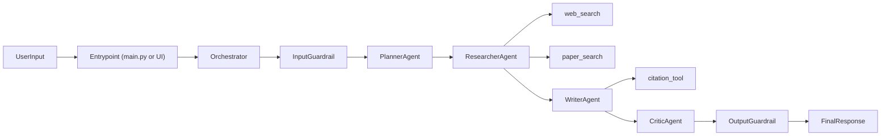
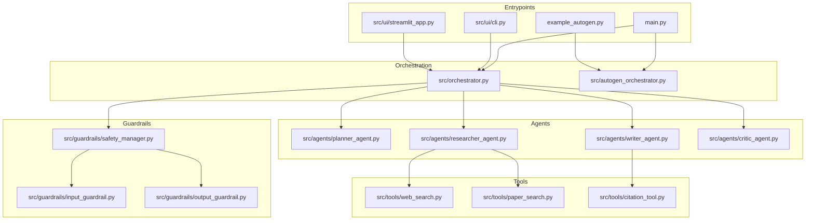
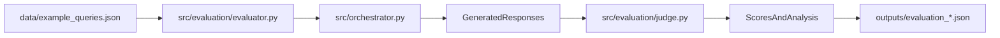

# Multi-Agent Research System


A production-style multi-agent research assistant that plans, investigates, synthesizes, critiques, and safety-checks responses before returning final output with citations.

## Why This Project

This project demonstrates practical multi-agent orchestration patterns for:

- staged task decomposition (`plan -> research -> write -> critique`)
- tool-augmented retrieval (web + academic sources)
- safety guardrails on both input and output
- iterative quality improvement with a critic loop
- offline benchmarking via LLM-as-a-Judge evaluation

## Quick Navigation

- [Quick Start](#quick-start)
- [Architecture](#architecture)
- [Run Modes](#run-modes)
- [Evaluation](#evaluation-and-metrics)
- [Configuration](#configuration)
- [Project Structure](#project-structure)
- [Before You Push](#before-you-push)

## Quick Start

```bash
python -m venv venv
source venv/bin/activate  # Windows: venv\Scripts\activate
pip install -r requirements.txt
# Create .env with required API keys
python main.py --mode web
```

<details>
<summary><strong>Required API keys</strong></summary>

Use at least one LLM key and one search key:

```bash
GROQ_API_KEY=...
# OR OPENAI_API_KEY=...

TAVILY_API_KEY=...
# OR BRAVE_API_KEY=...
```

Optional:

```bash
SEMANTIC_SCHOLAR_API_KEY=...
```

</details>

## Architecture

### Runtime Flow



### Component Layout



### Evaluation Flow



## Run Modes

The entrypoint supports these modes:

```bash
python main.py --mode cli
python main.py --mode web
python main.py --mode evaluate
python main.py --mode autogen
python main.py --mode sequential
```

- `cli`: terminal interface with traces and safety indicators
- `web`: Streamlit interface for interactive exploration
- `evaluate`: benchmark against query set with judge scoring
- `autogen`: run AutoGen-driven orchestration example
- `sequential`: run the direct sequential orchestrator path

<details>
<summary><strong>Sequential vs AutoGen</strong></summary>

- Use `Sequential Orchestrator` for easier debugging and deterministic traces.
- Use `AutoGen Orchestrator` for richer multi-agent conversational dynamics.

</details>

## Evaluation and Metrics

Run evaluation:

```bash
python main.py --mode evaluate
```

Outputs are written to `outputs/`:

- `evaluation_*.json`: full per-query results and criterion scores
- `evaluation_summary_*.txt`: aggregated metrics and distributions

The default criteria in `config.yaml` are:

- relevance
- evidence_quality
- factual_accuracy
- safety_compliance
- clarity

Detailed instructions: `docs/HOW_TO_RUN_EVALUATION.md`.

## Configuration

Primary controls live in `config.yaml`:

- `system`: project/topic metadata, max iterations, timeout
- `agents`: per-agent roles, enable flags, and optional custom prompts
- `models`: default and judge model/provider settings
- `tools`: web and paper search providers and limits
- `safety`: violation categories and handling strategy
- `evaluation`: test query count and weighted criteria
- `logging`: runtime and safety log destinations

## Project Structure

```text
.
├── src/
│   ├── agents/
│   ├── evaluation/
│   ├── guardrails/
│   ├── tools/
│   ├── ui/
│   ├── orchestrator.py
│   └── autogen_orchestrator.py
├── data/
├── docs/
├── logs/
├── outputs/
├── config.yaml
├── requirements.txt
└── main.py
```

## Development Notes

- Install local security hooks: `./scripts/install-hooks.sh`
- Run security checks: `./scripts/test-security.sh`
- Logs:
  - `logs/system.log`
  - `logs/safety_events.log`

## Before You Push

Use this checklist for a clean public commit:

- `.env` is local-only and never committed
- noisy local files are ignored (`.DS_Store`, virtual envs, cache files)
- docs links and Mermaid diagrams render correctly on GitHub
- one smoke run succeeds (for example `python main.py --mode sequential`)
- evaluation docs and README stay consistent

## License

Licensed under Apache 2.0. See `LICENSE`.
