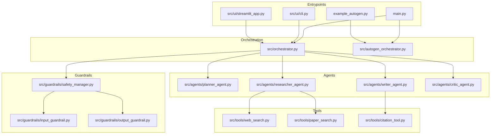
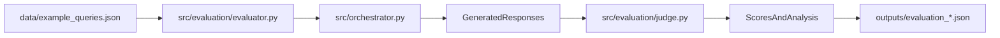

# Multi-Agent Research System


An intelligent research assistant powered by collaborating AI agents. It plans research, gathers evidence from web and paper sources, writes citation-backed answers, critiques output quality, and applies safety guardrails.

## Quick Navigation

- [What This System Does](#what-this-system-does)
- [Quick Start](#quick-start)
- [Architecture](#architecture)
- [Run Modes](#run-modes)
- [Evaluation](#evaluation-and-metrics)
- [Before You Push](#before-you-push)

## What This System Does

- `Planner Agent`: breaks down complex queries into an actionable plan
- `Researcher Agent`: gathers evidence from web and academic sources
- `Writer Agent`: synthesizes findings into cited responses
- `Critic Agent`: reviews quality and requests revisions if needed
- `Safety Guardrails`: checks both input and output for policy compliance

## Quick Start

```bash
python -m venv venv
source venv/bin/activate  # Windows: venv\Scripts\activate
pip install -r requirements.txt
# create .env with your API keys
python main.py --mode web
```

<details>
<summary><strong>API keys required (expand)</strong></summary>

Set at least one LLM key and one search key:

```bash
GROQ_API_KEY=...
# OR OPENAI_API_KEY=...

TAVILY_API_KEY=...
# OR BRAVE_API_KEY=...
```

Optional:

```bash
SEMANTIC_SCHOLAR_API_KEY=...
```

</details>

## Architecture

### Runtime Flow

```mermaid
flowchart LR
  userInput[UserInput] --> entrypoint[Entrypoint(main.pyOrUI)]
  entrypoint --> orchestrator[Orchestrator]
  orchestrator --> inputGuardrail[InputGuardrail]
  inputGuardrail --> plannerAgent[PlannerAgent]
  plannerAgent --> researcherAgent[ResearcherAgent]
  researcherAgent --> toolWeb[web_search]
  researcherAgent --> toolPaper[paper_search]
  researcherAgent --> writerAgent[WriterAgent]
  writerAgent --> citationTool[citation_tool]
  writerAgent --> criticAgent[CriticAgent]
  criticAgent --> outputGuardrail[OutputGuardrail]
  outputGuardrail --> finalResponse[FinalResponse]
```

### Component Layout



### Evaluation Flow



## Run Modes

Modes currently supported by `main.py`:

- `cli`: interactive terminal interface
- `web`: Streamlit web interface
- `evaluate`: run full LLM-as-a-Judge evaluation
- `autogen`: run AutoGen orchestration example
- `sequential`: run sequential orchestrator demo query

```bash
python main.py --mode cli
python main.py --mode web
python main.py --mode evaluate
python main.py --mode autogen
python main.py --mode sequential
```

<details>
<summary><strong>When to use Sequential vs AutoGen (expand)</strong></summary>

- Use `Sequential Orchestrator` (`src/orchestrator.py`) for easier debugging and deterministic workflow tracing.
- Use `AutoGen Orchestrator` (`src/autogen_orchestrator.py`) for richer agent-to-agent conversation patterns.

</details>

---

## 📁 Project Structure

Understanding the codebase is straightforward—each directory has a clear purpose:

```
.
├── src/
│   ├── agents/              # 🤖 The AI agents (Planner, Researcher, Writer, Critic)
│   ├── guardrails/          # 🛡️ Safety mechanisms
│   ├── tools/               # 🔧 Research tools (web search, paper search, citations)
│   ├── evaluation/          # 📊 LLM-as-a-Judge evaluation system
│   ├── ui/                  # 💻 User interfaces (CLI and web)
│   └── orchestrator.py      # 🎭 Coordinates agent interactions
├── data/
│   └── example_queries.json # 📝 Test queries for evaluation
├── docs/                    # 📚 Additional documentation
├── config.yaml              # ⚙️ System configuration
├── requirements.txt         # 📦 Python dependencies
└── main.py                  # 🚪 Entry point
```

**Key Files to Know:**
- `main.py` - Start here to run the system
- `config.yaml` - Customize agent behavior, safety policies, and evaluation criteria
- `src/orchestrator.py` - Sequential workflow orchestrator
- `src/autogen_orchestrator.py` - AutoGen-based multi-agent orchestration

---

## 🛠️ Setup Instructions

### 1. Prerequisites

Before you begin, ensure you have:

- **Python 3.9 or higher** - Check with `python --version`
- **Package manager** - Either `pip` (comes with Python) or `uv` (faster, optional)
- **Git** - To clone the repository

**Don't have Python 3.9+?** Download it from [python.org](https://www.python.org/downloads/)

### 2. Installation

#### Option A: Using pip (Standard - Works Everywhere)

```bash
# Create a virtual environment (recommended)
python -m venv venv

# Activate it
# On macOS/Linux:
source venv/bin/activate
# On Windows:
venv\Scripts\activate

# Install dependencies
pip install -r requirements.txt
```

#### Option B: Using uv (Faster - Optional)

`uv` is a modern Python package installer that's significantly faster than pip.

```bash
# Install uv first
curl -LsSf https://astral.sh/uv/install.sh | sh  # macOS/Linux
# OR
pip install uv  # Works everywhere

# Create virtual environment and install dependencies
uv venv
source .venv/bin/activate  # On Windows: .venv\Scripts\activate
uv pip install -r requirements.txt
```

**Troubleshooting**: If you encounter permission errors, try using `python -m pip` instead of just `pip`.

### 3. Security Setup (Important!)

**⚠️ Protect Your API Keys**: Before committing code, set up pre-commit hooks that automatically scan for accidentally hardcoded API keys:

```bash
# Quick setup
./scripts/install-hooks.sh

# This ensures you never accidentally commit API keys
```

These hooks run automatically before each commit and will block commits containing API keys or secrets.

### 4. API Keys Configuration

The system needs API keys to function. Here's how to get them set up:

#### Step 1: Create a `.env` file

In the project root, create a file named `.env` (no extension) with the following format:

```bash
# Required: At least one LLM API key
GROQ_API_KEY=your_groq_api_key_here
# OR OPENAI_API_KEY=your_openai_api_key_here

# Recommended: At least one search API key  
TAVILY_API_KEY=your_tavily_api_key_here
# OR BRAVE_API_KEY=your_brave_api_key_here

# Optional: For academic paper search
SEMANTIC_SCHOLAR_API_KEY=your_semantic_scholar_api_key_here
```

#### Step 2: Get Your API Keys

**For LLM (Choose at least one):**
- **Groq** ⭐ Recommended for students - [Get free API key](https://console.groq.com) - Fast and free tier available
- **OpenAI** - [Get API key](https://platform.openai.com) - Requires paid credits

**For Search (Choose at least one):**
- **Tavily** ⭐ Recommended - [Get free student quota](https://www.tavily.com) - Optimized for research
- **Brave Search** - [Get API key](https://brave.com/search/api) - Alternative search engine

**For Academic Papers (Optional but Recommended):**
- **Semantic Scholar** - [Get free API key](https://www.semanticscholar.org/product/api) - Access to millions of research papers

**💡 Tip**: Start with Groq + Tavily for the best free-tier experience.

#### Step 3: Verify Your Setup

After creating `.env`, test it:

```bash
python -c "from dotenv import load_dotenv; import os; load_dotenv(); print('✅ GROQ_KEY:', 'Set' if os.getenv('GROQ_API_KEY') else '❌ Missing')"
```

**🔒 Security Note**: The `.env` file is already in `.gitignore`, so it won't be committed to version control. Never share your API keys publicly.

### 5. Configuration

The system behavior is controlled by `config.yaml`. You can customize:

- **Research topic** - Currently set to HCI research
- **Agent prompts** - Customize how each agent behaves
- **Safety policies** - Define what content should be blocked
- **Evaluation criteria** - Adjust how responses are scored

**Don't need to customize?** The default configuration works great out of the box.

**Want to customize agent prompts?** See the [Customizing Agent Prompts](#customizing-agent-prompts) section below.

---

## 🎮 Using the System

### Web Interface (Recommended for Beginners)

Launch the interactive web interface:

```bash
python main.py --mode web
```

This opens a browser-based interface where you can:
- Type research questions naturally
- See agents working in real-time
- View citations and sources
- Check safety alerts
- Review query history

**Best for**: Interactive exploration and demonstrations.

### Command Line Interface

For terminal users and automation:

```bash
python main.py --mode cli
```

This provides an interactive command-line interface with:
- Text-based query input
- Agent trace display
- Safety event indicators
- Helpful commands (`help`, `quit`, `stats`)

**Best for**: Power users, scripts, and automation.

### Running Examples

**Try the AutoGen example** (interactive menu with multiple demos):

```bash
python main.py --mode autogen
# OR
python example_autogen.py
```

**Try the sequential orchestrator** (straightforward end-to-end example):

```bash
python main.py --mode sequential
```

---

## 📊 Evaluation and Metrics

### Running Evaluation

To evaluate the system's performance on a set of test queries:

```bash
python main.py --mode evaluate
```

**What this does:**
- Processes all queries in `data/example_queries.json`
- Evaluates each response using LLM-as-a-Judge
- Generates detailed reports in `outputs/`
- Produces summary statistics and scores

**⏱️ Time**: Takes 30-60 minutes depending on query count and API speeds.

### Understanding Evaluation Results

After evaluation completes, you'll find:

**Summary Report** (`outputs/evaluation_summary_*.txt`):
- Overall performance metrics
- Success rates
- Score distributions
- Quick overview of results

**Detailed Results** (`outputs/evaluation_*.json`):
- Individual query scores
- Breakdown by criteria (relevance, evidence quality, accuracy, safety, clarity)
- Judge reasoning for each score
- Complete evaluation data

**Key Metrics Explained:**
- **Overall Score** (0.0-1.0): Average quality across all criteria
- **Relevance**: How well the response addresses the query
- **Evidence Quality**: Source credibility and citation quality
- **Factual Accuracy**: Correctness of information
- **Safety Compliance**: Adherence to safety policies
- **Clarity**: Readability and organization

### Quick Test (Fewer Queries)

Want to test faster? Edit `config.yaml`:

```yaml
evaluation:
  enabled: true
  num_test_queries: 5  # Test with just 5 queries first
```

See `docs/HOW_TO_RUN_EVALUATION.md` for detailed instructions on extracting and interpreting metrics.

---

## 🎓 Advanced Usage

### Customizing Agent Prompts

You can customize how each agent behaves by editing `config.yaml`:

```yaml
agents:
  planner:
    system_prompt: |
      You are an expert research planner specializing in HCI.
      Focus on recent publications (last 5 years) and seminal works.
      After creating the plan, say "PLAN COMPLETE".
```

**⚠️ Important**: Custom prompts must include handoff signals so agents know when to pass control:
- **Planner**: Must include `"PLAN COMPLETE"`
- **Researcher**: Must include `"RESEARCH COMPLETE"`
- **Writer**: Must include `"DRAFT COMPLETE"`
- **Critic**: Must include `"APPROVED - RESEARCH COMPLETE"` or `"NEEDS REVISION"`

Leave `system_prompt: ""` empty to use default, optimized prompts.

### Understanding the Workflow

The system follows a structured research workflow:

1. **Input Validation** - Safety guardrails check the query
2. **Planning Phase** - Planner agent breaks down the research question
3. **Research Phase** - Researcher agent gathers evidence from multiple sources
4. **Writing Phase** - Writer agent synthesizes findings with citations
5. **Review Phase** - Critic agent evaluates quality
6. **Revision Loop** - If needed, Writer improves based on Critic feedback
7. **Output Validation** - Final safety check before returning response

**Iteration Limit**: The system will attempt up to 10 iterations (configurable) to improve response quality.

### Safety Guardrails

The system includes comprehensive safety mechanisms:

**What Gets Blocked:**
- Harmful content (violence, self-harm, dangerous instructions)
- Personal attacks and toxic language
- Misinformation and off-topic queries
- Inappropriate content

**How It Works:**
- Input guardrails check queries before processing
- Output guardrails verify responses before returning
- Violations are logged with detailed information
- Users are notified when content is blocked or sanitized

**Safety Events** are logged in `logs/safety_events.log` with timestamps, violation types, and actions taken.

---

## 🔍 Understanding the Codebase

### Agent Architecture

Each agent is a specialized AI assistant:

- **`BaseAgent`** (`src/agents/base_agent.py`): Common functionality for all agents
- **`PlannerAgent`**: Breaks queries into research steps
- **`ResearcherAgent`**: Uses tools to search web and academic papers
- **`WriterAgent`**: Synthesizes evidence into coherent responses
- **`CriticAgent`**: Evaluates response quality and provides feedback

### Orchestration

Two orchestrator implementations:

1. **Sequential Orchestrator** (`src/orchestrator.py`):
   - Simple, linear workflow
   - Easy to understand and debug
   - Good for learning and development

2. **AutoGen Orchestrator** (`src/autogen_orchestrator.py`):
   - Advanced multi-agent coordination
   - Agents communicate directly
   - More flexible and powerful

### Tools

The research tools enable evidence gathering:

- **Web Search** (`src/tools/web_search.py`): Searches the web via Tavily or Brave
- **Paper Search** (`src/tools/paper_search.py`): Finds academic papers via Semantic Scholar
- **Citation Tool** (`src/tools/citation_tool.py`): Formats citations in APA style

---

## 🧪 Testing and Troubleshooting

### Running Tests

```bash
pytest tests/
```

### Common Issues

**Problem**: "ModuleNotFoundError" or import errors  
**Solution**: Make sure your virtual environment is activated and dependencies are installed: `pip install -r requirements.txt`

**Problem**: "API key not found" errors  
**Solution**: Check that your `.env` file exists in the project root and contains valid API keys

**Problem**: Evaluation takes too long  
**Solution**: Reduce the number of test queries in `config.yaml` or use a faster LLM API

**Problem**: Agents not completing their tasks  
**Solution**: Check the logs in `logs/` for detailed error messages. Ensure API keys have sufficient quotas.

### Getting Help

1. Check the logs: `logs/system.log` and `logs/safety_events.log`
2. Review configuration in `config.yaml`
3. See `docs/HOW_TO_RUN_EVALUATION.md` for evaluation-specific help
4. Review the code comments for implementation details

---

## 📚 Additional Resources

### Documentation

- **Evaluation Guide**: `docs/HOW_TO_RUN_EVALUATION.md` - Detailed evaluation instructions
- **Assignment Instructions**: `docs/ASSIGNMENT_INSTRUCTIONS.md` - Original assignment requirements

### External Documentation

- [AutoGen Documentation](https://microsoft.github.io/autogen/) - Multi-agent framework
- [LangGraph Documentation](https://langchain-ai.github.io/langgraph/) - Alternative orchestration framework
- [Tavily API Docs](https://docs.tavily.com/) - Search API documentation
- [Semantic Scholar API](https://api.semanticscholar.org/) - Academic paper search
- [Guardrails AI](https://docs.guardrailsai.com/) - Safety framework documentation

---

## 🎯 Reproducing Results

To reproduce the evaluation results:

1. **Complete Setup**: Follow all setup instructions above
2. **Run Evaluation**: `python main.py --mode evaluate`
3. **Review Results**: Check `outputs/evaluation_*.json` for detailed metrics
4. **Compare**: Use the generated reports to compare with expected results

**Note**: Due to LLM non-determinism, results may vary slightly between runs. For stable metrics, run multiple times and average the results.

---

## Before You Push

Use this quick pre-push checklist to keep the repo clean and presentation-ready:

- Confirm secrets are not tracked (`.env` should stay local only)
- Run security hooks setup once: `./scripts/install-hooks.sh`
- Run a quick smoke mode: `python main.py --mode sequential`
- Verify docs links and Mermaid blocks render correctly on GitHub
- Ensure noisy local files like `.DS_Store` are ignored

---

## 📝 License

See `LICENSE` file for details.

---

## 🙏 Acknowledgments

This project demonstrates the capabilities of multi-agent AI systems for research tasks, combining orchestration frameworks, safety mechanisms, and evaluation techniques to create a production-ready research assistant.

**Built with**: Python, AutoGen, Streamlit, Guardrails AI, and various research APIs.

---

**Ready to start?** Jump to [Quick Start](#-quick-start) above, or dive into [Setup Instructions](#️-setup-instructions) for detailed guidance!
