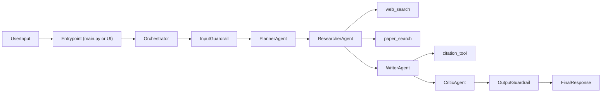
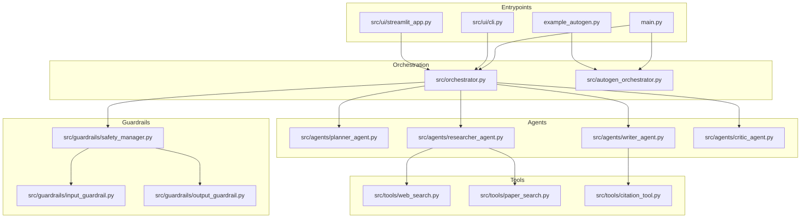
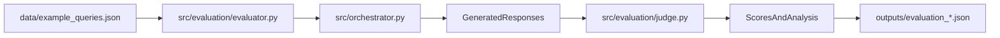

<div align="center">

# Multi-Agent Research System

[](https://www.python.org/)
[](LICENSE)
[](#)
[](https://streamlit.io/)
[](https://www.langchain.com/langgraph)


A production-style multi-agent research assistant that plans, investigates, synthesizes, critiques, and safety-checks responses before returning final output with citations.

[Quick Start](#quick-start) · [Architecture](#architecture) · [Run Modes](#run-modes) · [Evaluation](#evaluation-and-metrics) · [Config](#configuration)

</div>

---

## Why This Project

This project demonstrates practical multi-agent orchestration patterns for:

| | Pattern |
|---|---|
| 🧩 | Staged task decomposition (`plan → research → write → critique`) |
| 🔎 | Tool-augmented retrieval (web + academic sources) |
| 🛡️ | Safety guardrails on both input and output |
| 🔁 | Iterative quality improvement with a critic loop |
| 📊 | Offline benchmarking via LLM-as-a-Judge evaluation |

## Quick Start

```bash
python -m venv venv
source venv/bin/activate  # Windows: venv\Scripts\activate
pip install -r requirements.txt
# Create .env with required API keys
python main.py --mode web
```

<details>
<summary><strong>Required API keys</strong></summary>

Use at least one LLM key and one search key:

```bash
GROQ_API_KEY=...
# OR OPENAI_API_KEY=...

TAVILY_API_KEY=...
# OR BRAVE_API_KEY=...
```

Optional:

```bash
SEMANTIC_SCHOLAR_API_KEY=...
```

</details>

## Architecture

### Runtime Flow


```mermaid
flowchart LR
  userInput["UserInput"] --> entrypoint["Entrypoint (main.py or UI)"]
  entrypoint --> orchestrator["Orchestrator"]
  orchestrator --> inputGuardrail["InputGuardrail"]
  inputGuardrail --> plannerAgent["PlannerAgent"]
  plannerAgent --> researcherAgent["ResearcherAgent"]
  researcherAgent --> toolWeb["web_search"]
  researcherAgent --> toolPaper["paper_search"]
  researcherAgent --> writerAgent["WriterAgent"]
  writerAgent --> citationTool["citation_tool"]
  writerAgent --> criticAgent["CriticAgent"]
  criticAgent --> outputGuardrail["OutputGuardrail"]
  outputGuardrail --> finalResponse["FinalResponse"]
```

### Component Layout


```mermaid
flowchart TB
  subgraph entrypoints [Entrypoints]
    mainPy["main.py"]
    cliPy["src/ui/cli.py"]
    streamlitPy["src/ui/streamlit_app.py"]
    autogenExample["example_autogen.py"]
  end

  subgraph orchestration [Orchestration]
    seqOrch["src/orchestrator.py"]
    autoOrch["src/autogen_orchestrator.py"]
  end

  subgraph agents [Agents]
    planner["src/agents/planner_agent.py"]
    researcher["src/agents/researcher_agent.py"]
    writer["src/agents/writer_agent.py"]
    critic["src/agents/critic_agent.py"]
  end

  subgraph guardrails [Guardrails]
    safety["src/guardrails/safety_manager.py"]
    inGuard["src/guardrails/input_guardrail.py"]
    outGuard["src/guardrails/output_guardrail.py"]
  end

  subgraph tools [Tools]
    webTool["src/tools/web_search.py"]
    paperTool["src/tools/paper_search.py"]
    citeTool["src/tools/citation_tool.py"]
  end

  mainPy --> seqOrch
  mainPy --> autoOrch
  cliPy --> seqOrch
  streamlitPy --> seqOrch
  autogenExample --> autoOrch
  seqOrch --> safety
  safety --> inGuard
  safety --> outGuard
  seqOrch --> planner
  seqOrch --> researcher
  seqOrch --> writer
  seqOrch --> critic
  researcher --> webTool
  researcher --> paperTool
  writer --> citeTool
```

### Evaluation Flow


```mermaid
flowchart LR
  querySet["data/example_queries.json"] --> evaluator["src/evaluation/evaluator.py"]
  evaluator --> orchestratorPath["src/orchestrator.py"]
  orchestratorPath --> responses["GeneratedResponses"]
  responses --> judge["src/evaluation/judge.py"]
  judge --> metrics["ScoresAndAnalysis"]
  metrics --> outputReports["outputs/evaluation_*.json"]
```

## Run Modes

```bash
python main.py --mode cli
python main.py --mode web
python main.py --mode evaluate
python main.py --mode autogen
python main.py --mode sequential
```

| Mode | Description |
|------|-------------|
| `cli` | Terminal interface with traces and safety indicators |
| `web` | Streamlit interface for interactive exploration |
| `evaluate` | Benchmark against query set with judge scoring |
| `autogen` | AutoGen-driven orchestration example |
| `sequential` | Direct sequential orchestrator path |

<details>
<summary><strong>Sequential vs AutoGen</strong></summary>

- Use **Sequential Orchestrator** for easier debugging and deterministic traces.
- Use **AutoGen Orchestrator** for richer multi-agent conversational dynamics.

</details>

## Evaluation and Metrics

```bash
python main.py --mode evaluate
```

Outputs land in `outputs/`:

- `evaluation_*.json` — full per-query results and criterion scores
- `evaluation_summary_*.txt` — aggregated metrics and distributions

Default criteria in `config.yaml`:

`relevance` · `evidence_quality` · `factual_accuracy` · `safety_compliance` · `clarity`

Detailed instructions: [`docs/HOW_TO_RUN_EVALUATION.md`](docs/HOW_TO_RUN_EVALUATION.md)

## Configuration

Primary controls live in [`config.yaml`](config.yaml):

| Key | Purpose |
|-----|---------|
| `system` | Project/topic metadata, max iterations, timeout |
| `agents` | Per-agent roles, enable flags, optional custom prompts |
| `models` | Default and judge model/provider settings |
| `tools` | Web and paper search providers and limits |
| `safety` | Violation categories and handling strategy |
| `evaluation` | Test query count and weighted criteria |
| `logging` | Runtime and safety log destinations |

## Project Structure

```text
.
├── src/
│   ├── agents/          # planner, researcher, writer, critic
│   ├── evaluation/      # LLM-as-a-Judge benchmarking
│   ├── guardrails/      # input / output safety
│   ├── tools/           # web, paper, citation
│   ├── ui/              # CLI + Streamlit
│   ├── orchestrator.py
│   └── autogen_orchestrator.py
├── data/
├── docs/
├── logs/
├── outputs/
├── config.yaml
├── requirements.txt
└── main.py
```

## Development Notes

- Install local security hooks: `./scripts/install-hooks.sh`
- Run security checks: `./scripts/test-security.sh`
- Logs: `logs/system.log` · `logs/safety_events.log`

## Before You Push

- [ ] `.env` is local-only and never committed
- [ ] noisy local files are ignored (`.DS_Store`, virtual envs, cache)
- [ ] docs links and Mermaid diagrams render correctly on GitHub
- [ ] one smoke run succeeds (e.g. `python main.py --mode sequential`)
- [ ] evaluation docs and README stay consistent

## License

Licensed under [Apache 2.0](LICENSE).
