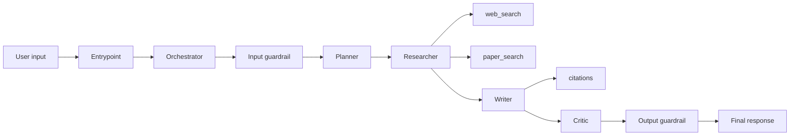
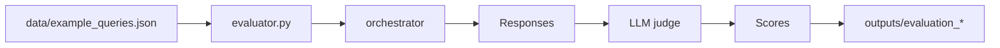

<div align="center">

# Multi-Agent Research System

[](https://www.python.org/)
[](LICENSE)
[](https://streamlit.io/)
[](https://www.langchain.com/langgraph)


**TL;DR — One sentence:** A production-style multi-agent research assistant that plans, searches the web/papers, writes an answer with citations, critiques itself, and runs safety checks — with CLI, Streamlit UI, and offline LLM-as-a-Judge evaluation.

**Why it matters:** “Chat with an LLM” is easy. Shipping a *system* of specialized agents with tools, guardrails, and measurable quality is the hard part. This lab shows that full loop in one runnable codebase.

[Quick start](#quick-start) · [Architecture](#architecture) · [Run modes](#run-modes) · [Evaluation](#evaluation-and-metrics)

</div>

---

## What this is (in plain English)

Ask a research question. The system does not answer in one shot. It runs a staged pipeline:

**Plan → Research (tools) → Write (citations) → Critique → Safety check → Final answer**

You can drive it from a terminal, a Streamlit web UI, or a batch evaluation mode that scores outputs against fixed criteria.

Two orchestration styles ship side by side:

- **Sequential** — deterministic, easy to debug  
- **AutoGen** — richer multi-agent conversation dynamics  

---

## Why it's interesting / significant

| Pattern | What you get |
|---|---|
| **Task decomposition** | Separate planner, researcher, writer, and critic — not one mega-prompt |
| **Tool-augmented retrieval** | Web search + academic paper search feeding the writer |
| **Safety guardrails** | Input and output checks before anything ships |
| **Critic loop** | Iterative quality improvement instead of “first draft = final” |
| **Offline evaluation** | LLM-as-a-Judge benchmarking with weighted criteria and saved reports |

This is a strong portfolio artifact for anyone evaluating whether you understand **agent orchestration in practice**, not only theory.

---

## Quick start

```bash
python -m venv venv
source venv/bin/activate  # Windows: venv\Scripts\activate
pip install -r requirements.txt
# Create .env with API keys (see below)
python main.py --mode web
```

<details>
<summary><strong>Required API keys</strong></summary>

At least one LLM key and one search key:

```bash
GROQ_API_KEY=...
# OR OPENAI_API_KEY=...

TAVILY_API_KEY=...
# OR BRAVE_API_KEY=...
```

Optional:

```bash
SEMANTIC_SCHOLAR_API_KEY=...
```

</details>

---

## Architecture

### Runtime flow


```mermaid
flowchart LR
  userInput["User input"] --> entrypoint["Entrypoint"]
  entrypoint --> orchestrator["Orchestrator"]
  orchestrator --> inputGuardrail["Input guardrail"]
  inputGuardrail --> plannerAgent["Planner"]
  plannerAgent --> researcherAgent["Researcher"]
  researcherAgent --> toolWeb["web_search"]
  researcherAgent --> toolPaper["paper_search"]
  researcherAgent --> writerAgent["Writer"]
  writerAgent --> citationTool["citations"]
  writerAgent --> criticAgent["Critic"]
  criticAgent --> outputGuardrail["Output guardrail"]
  outputGuardrail --> finalResponse["Final response"]
```

### Layout

| Area | Path |
|------|------|
| Agents | `src/agents/` — planner, researcher, writer, critic |
| Orchestration | `src/orchestrator.py`, `src/autogen_orchestrator.py` |
| Guardrails | `src/guardrails/` |
| Tools | `src/tools/` — web, paper, citation |
| UI | `src/ui/` — CLI + Streamlit |
| Evaluation | `src/evaluation/` — judge + metrics |
| Config | `config.yaml` |

---

## Run modes

```bash
python main.py --mode cli
python main.py --mode web
python main.py --mode evaluate
python main.py --mode autogen
python main.py --mode sequential
```

| Mode | Use when |
|------|----------|
| `cli` | Terminal traces and safety indicators |
| `web` | Interactive Streamlit exploration |
| `evaluate` | Benchmark a query set with judge scores |
| `autogen` | AutoGen-style multi-agent dynamics |
| `sequential` | Direct sequential path for debugging |

---

## Evaluation and metrics

```bash
python main.py --mode evaluate
```

Outputs in `outputs/`:

- `evaluation_*.json` — per-query results and criterion scores  
- `evaluation_summary_*.txt` — aggregates and distributions  

Default criteria (`config.yaml`): `relevance` · `evidence_quality` · `factual_accuracy` · `safety_compliance` · `clarity`

Guide: [`docs/HOW_TO_RUN_EVALUATION.md`](docs/HOW_TO_RUN_EVALUATION.md)


```mermaid
flowchart LR
  querySet["data/example_queries.json"] --> evaluator["evaluator.py"]
  evaluator --> orchestratorPath["orchestrator"]
  orchestratorPath --> responses["Responses"]
  responses --> judge["LLM judge"]
  judge --> metrics["Scores"]
  metrics --> outputReports["outputs/evaluation_*"]
```

---

## Configuration

Primary controls in [`config.yaml`](config.yaml):

| Section | Purpose |
|---------|---------|
| `system` | Metadata, max iterations, timeout |
| `agents` | Roles, enable flags, optional prompts |
| `models` | Default + judge provider settings |
| `tools` | Search providers and limits |
| `safety` | Violation categories and handling |
| `evaluation` | Query count and weighted criteria |
| `logging` | Runtime and safety log paths |

---

## Project structure

```text
.
├── src/
│   ├── agents/
│   ├── evaluation/
│   ├── guardrails/
│   ├── tools/
│   ├── ui/
│   ├── orchestrator.py
│   └── autogen_orchestrator.py
├── data/
├── docs/
├── outputs/
├── config.yaml
├── requirements.txt
└── main.py
```

**Dev helpers:** `./scripts/install-hooks.sh` · `./scripts/test-security.sh` · logs in `logs/`

---

## License

[Apache 2.0](LICENSE). Keep `.env` local — never commit API keys.
